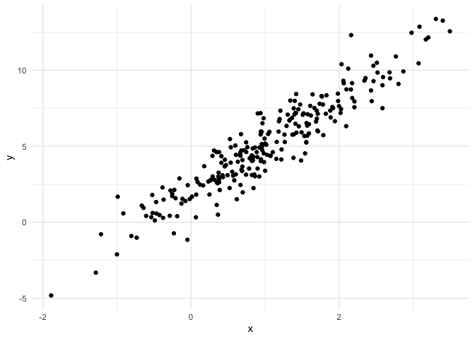
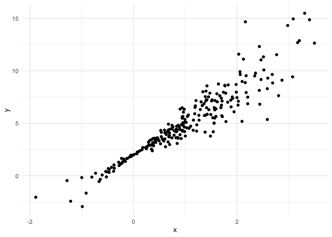
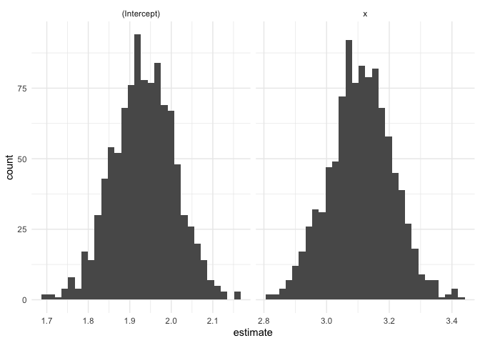
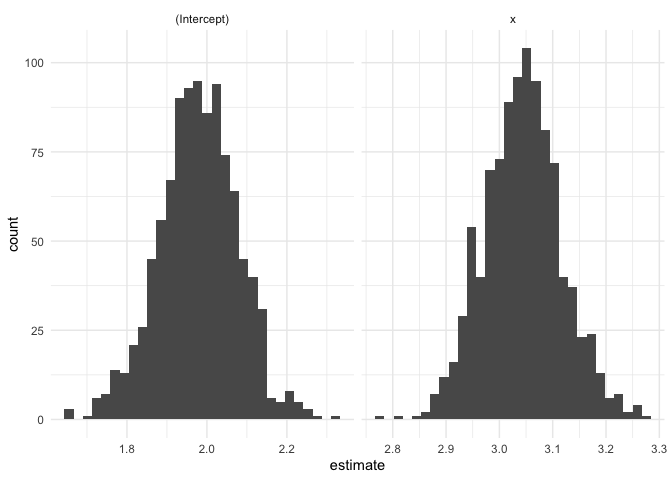
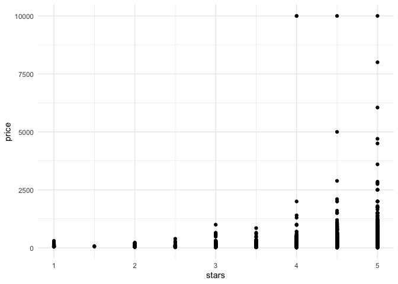
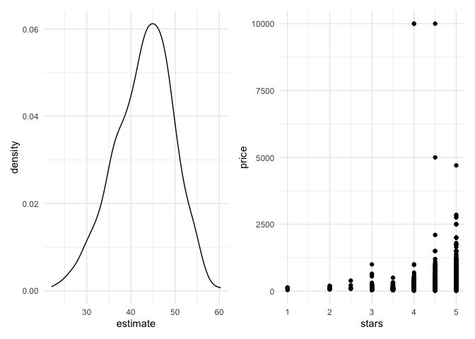

Bootstrapping
================
Ruiqi Yan
11/23/2021

``` r
set.seed(1)
n_samp = 250

sim_df_const = 
  tibble(
    x = rnorm(n_samp, 1, 1),
    error = rnorm(n_samp, 0, 1),
    y = 2 + 3 * x + error
  )

sim_df_nonconst = sim_df_const %>% 
  mutate(
  error = error * .75 * x,
  y = 2 + 3 * x + error
)
```

``` r
sim_df_const %>% 
  ggplot(aes(x = x, y = y)) +
  geom_point()
```

<!-- -->

``` r
sim_df_nonconst %>% 
  ggplot(aes(x = x, y = y)) +
  geom_point()
```

<!-- -->

``` r
sim_df_const %>% 
  lm(y ~ x, data = .) %>% 
  broom::tidy()
```

    ## # A tibble: 2 × 5
    ##   term        estimate std.error statistic   p.value
    ##   <chr>          <dbl>     <dbl>     <dbl>     <dbl>
    ## 1 (Intercept)     1.98    0.0981      20.2 3.65e- 54
    ## 2 x               3.04    0.0699      43.5 3.84e-118

``` r
sim_df_nonconst %>% 
  lm(y ~ x, data = .) %>% 
  broom::tidy()
```

    ## # A tibble: 2 × 5
    ##   term        estimate std.error statistic   p.value
    ##   <chr>          <dbl>     <dbl>     <dbl>     <dbl>
    ## 1 (Intercept)     1.93    0.105       18.5 1.88e- 48
    ## 2 x               3.11    0.0747      41.7 5.76e-114

## Let’s try to use the bootstrap for inference

``` r
bootstrap_sample <- 
  sim_df_nonconst %>% 
  sample_frac(size = 1, replace = TRUE) %>% 
  arrange(x)

lm(y ~ x, data = bootstrap_sample)
```

    ## 
    ## Call:
    ## lm(formula = y ~ x, data = bootstrap_sample)
    ## 
    ## Coefficients:
    ## (Intercept)            x  
    ##       1.897        3.196

Let’s write a function

``` r
boot_sample <- function(df){
  sample_frac(df, size = 1, replace = TRUE)
}
```

Now, we’ll make a tibble to keep track of everything

``` r
boot_strap_df <-
  tibble(
    strap_number = 1:1000,
    strap_sample = rerun(1000, boot_sample(sim_df_nonconst))
  )
```

From here … things are kinda the same as “always”

``` r
bootstrap_results <-
  boot_strap_df %>% 
  mutate(
    models = map(.x = strap_sample, ~lm(y ~ x, data = .x)),
    results = map(models, broom::tidy)
  ) %>% 
  select(strap_number, results) %>% 
  unnest(results)
bootstrap_results %>% 
  ggplot(aes(x = estimate)) +
  geom_histogram() +
  facet_grid(~term, scales = "free")
```

<!-- -->

``` r
lm(y ~ x, data = sim_df_nonconst) %>% 
  broom::tidy()
```

    ## # A tibble: 2 × 5
    ##   term        estimate std.error statistic   p.value
    ##   <chr>          <dbl>     <dbl>     <dbl>     <dbl>
    ## 1 (Intercept)     1.93    0.105       18.5 1.88e- 48
    ## 2 x               3.11    0.0747      41.7 5.76e-114

``` r
bootstrap_results %>% 
  group_by(term) %>% 
  summarize(
    se = sd(estimate)
  )
```

    ## # A tibble: 2 × 2
    ##   term            se
    ##   <chr>        <dbl>
    ## 1 (Intercept) 0.0747
    ## 2 x           0.101

Apply for constant dataframe

``` r
boot_strap_df_2 <-
  tibble(
    strap_number = 1:1000,
    strap_sample = rerun(1000, boot_sample(sim_df_const))
  )
```

From here … things are kinda the same as “always”

``` r
bootstrap_results_2 <-
  boot_strap_df_2 %>% 
  mutate(
    models = map(.x = strap_sample, ~lm(y ~ x, data = .x)),
    results = map(models, broom::tidy)
  ) %>% 
  select(strap_number, results) %>% 
  unnest(results)
bootstrap_results_2 %>% 
  ggplot(aes(x = estimate)) +
  geom_histogram() +
  facet_grid(~term, scales = "free")
```

<!-- -->

``` r
lm(y ~ x, data = sim_df_const) %>% 
  broom::tidy()
```

    ## # A tibble: 2 × 5
    ##   term        estimate std.error statistic   p.value
    ##   <chr>          <dbl>     <dbl>     <dbl>     <dbl>
    ## 1 (Intercept)     1.98    0.0981      20.2 3.65e- 54
    ## 2 x               3.04    0.0699      43.5 3.84e-118

``` r
bootstrap_results_2 %>% 
  group_by(term) %>% 
  summarize(
    se = sd(estimate)
  )
```

    ## # A tibble: 2 × 2
    ##   term            se
    ##   <chr>        <dbl>
    ## 1 (Intercept) 0.0984
    ## 2 x           0.0721

## Use `modelr`

``` r
bootstrap_results_df_modelr <-
  sim_df_nonconst %>% 
  bootstrap(n = 1000, id = "strap_number") %>% 
  mutate(
    models = map(.x = strap, ~lm(y ~ x, data = .x)),
    results = map(models, broom::tidy)
  )
```

``` r
data("nyc_airbnb")


nyc_airbnb <- 
  nyc_airbnb %>% 
  mutate(stars = review_scores_location / 2) %>% 
  rename(
    borough = neighbourhood_group,
    neighborhood = neighbourhood) %>% 
  filter(borough != "Staten Island") %>% 
  select(price, stars, borough, room_type)
```

``` r
nyc_airbnb %>% 
  ggplot(aes(x = stars, y = price)) +
  geom_point()
```

<!-- -->

``` r
airbnb_bootstrap_results <-
  nyc_airbnb %>% 
  filter(borough == "Manhattan") %>% 
  bootstrap(n = 1000, id = "strap_number") %>% 
  mutate(
    models = map(.x = strap, ~lm(price ~ stars, data = .x)),
    results = map(models, broom::tidy)
  ) %>% 
  select(strap_number, results) %>% 
  unnest(results)

gg_star_est <- 
  airbnb_bootstrap_results %>%
  filter(term == "stars") %>% 
  ggplot(aes(x = estimate)) + 
  geom_density()

ggp_scatter <-
  nyc_airbnb %>% 
  filter(borough == "Manhattan") %>%
  ggplot(aes(x = stars, y = price)) +
  geom_point()

gg_star_est + ggp_scatter
```

<!-- -->
