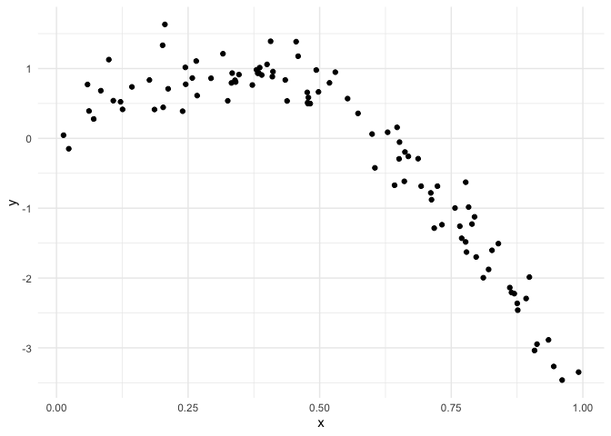
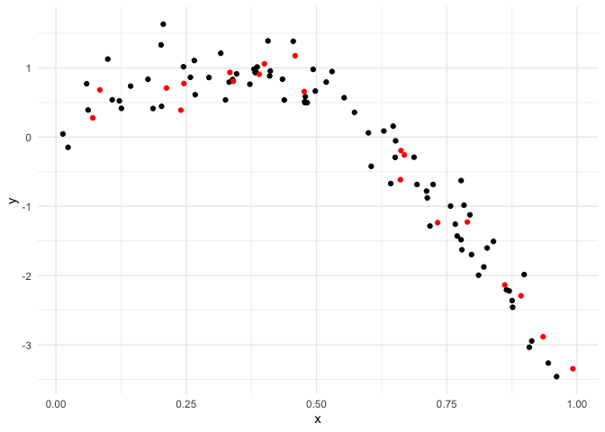
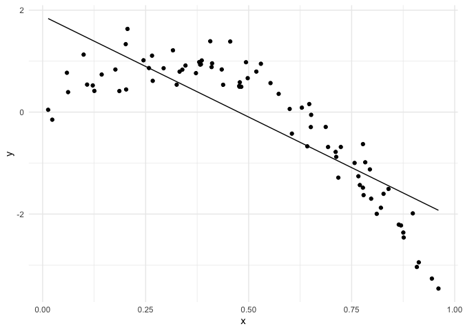

Cross validation
================
Ruiqi Yan
11/18/2021

Let’s simulate a dataset

``` r
set.seed(1)

nonlin_df = 
  tibble(
    id = 1:100,
    x = runif(100, 0, 1),
    y = 1 - 10 * (x - .3) ^ 2 + rnorm(100, 0, .3)
  )

nonlin_df %>% 
  ggplot(aes(x = x, y = y)) +
  geom_point()
```

<!-- -->

Create splits by hand; plot some models,

``` r
train_df <- sample_n(nonlin_df, size = 80)
test_df <- anti_join(nonlin_df, train_df, by = "id")

ggplot(train_df, aes(x = x, y = y)) +
  geom_point() +
  geom_point(data = test_df, color = "red")
```

<!-- -->

fit my models

``` r
linear_mod <- lm(y ~ x, data = train_df)
smooth_mod <- mgcv::gam(y ~ s(x), data = train_df)
wiggly_mod <- mgcv::gam(y ~ s(x, k = 30), sp = 10e-6, data = train_df)
```

plot the results

``` r
train_df %>% 
  add_predictions(linear_mod) %>% 
  ggplot(aes(x = x, y = y)) +
  geom_point() +
  geom_line(aes(y = pred)) 
```

<!-- -->

quantify the results

``` r
rmse(linear_mod, test_df)
```

    ## [1] 0.7052956

``` r
rmse(smooth_mod, test_df)
```

    ## [1] 0.2221774

``` r
rmse(wiggly_mod, test_df)
```

    ## [1] 0.289051
